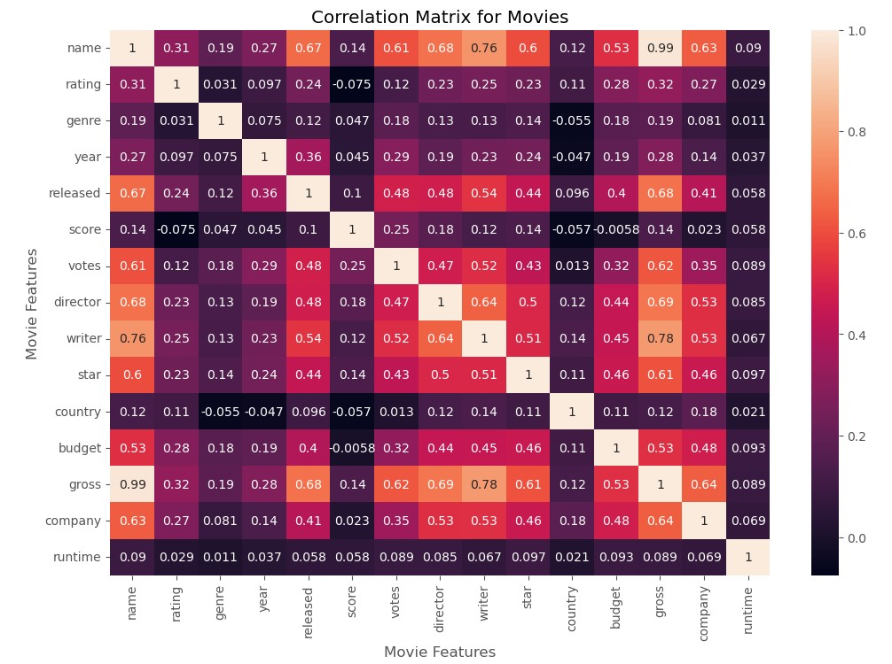

# Movie Features Correlations 🎞️

In this Python project we aim to find correlations between various movie features in order to better understand which features have highest correlations.

- seaborn
- matplotlib

Data Source 🧭

[Movie Industry](https://www.kaggle.com/datasets/danielgrijalvas/movies)

Following “Data Analyst Portfolio Project” from Alex The Analyst Youtube page. 👨‍🎓

[https://www.youtube.com/@AlexTheAnalyst](https://www.youtube.com/@AlexTheAnalyst)
